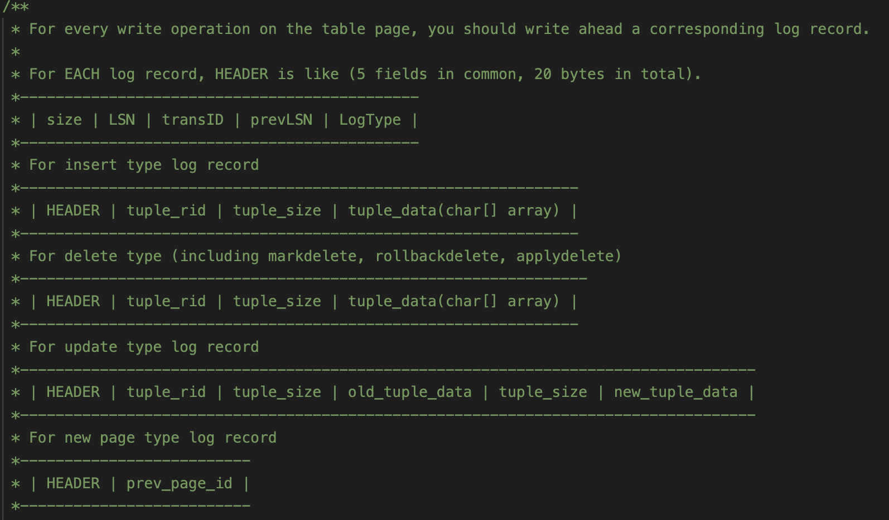
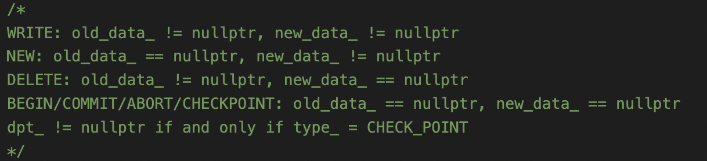

# JetSQL 

- 负责的部分？
  数据的序列化与反序列化、buffer pool的设计、记录表页结构的设计、执行器的设计。

  哈希索引、日志、多线程物理并发控制。

- 为什么需要序列化、反序列化？

  序列化 (Serialization)是将对象的状态信息转换为可以存储或传输的形式的过程。在序列化期间，对象将其当前状态写入到临时或持久性存储区。以后，可以通过从存储区中读取或反序列化对象的状态，重新创建该对象。

  序列化主要有两个用途

  **把对象的字节序列永久保存到硬盘上，通常存放在一个文件中（序列化对象）**
  **在网络上传送对象的字节序列（网络传输对象）**
  实际上就是将数据持久化，防止一直存储在内存当中，消耗内存资源。而且序列化后也能更好的便于网络运输何传播

  序列化：将对象转换为字节序列
  反序列化：把字节序列回恢复原先的对象

  往往不能直接将对象在内存中的字节序列直接存入磁盘作为序列化结果，因为类中很可能有指针，反序列化出来时地址会失效。另外，类内存结构由于需要对齐，存储效率也不是最高的，往往需要将成员字节序列紧密排列，这也是“序列”的含义。当然，代价是需要一些元信息去管理偏移。

- 数据库文件的磁盘格式是怎样的？

    0号物理页是disk meta，负责管理每个extent（最多管理1020个）。

    每个extend固定大小，extent的第一个页是bitmap页，管理后面若干（32704）个逻辑页。

    每个页设为4kB，所以每个.db文件最大大小是（1+1020+1020 * 32704）* 4kB 约为127GB

    只有逻辑页才对用户（buffer pool）是可见的，逻辑页号从0开始。

    磁盘的diskmeta、bitmap页也有一套缓存系统，disk manager管理。

- 表的物理结构是怎样的？

    每个表页的结构是slotted-page分槽页。catalog页会记录每个表的首页，每个表页会记录是不是有后续页，表页是按这种（磁盘上）链表的方式组织起来的。一个页如果是表页，会记录下一个表页的逻辑页号。

- buffer pool有什么作用？

    1. 作为磁盘逻辑页的缓存，加快页的读写速度。
    2. 给上层提供new/fetch/delete等访问页的接口。隐藏物理页管理的细节。
    3. 方便直接在这里进行页粒度的物理并发控制、日志记录添加，而不用分散在程序各个地方。（只有页粒度才能这么做）

- 堆表管理表页是什么意思？为什么能大幅提高插入速度？

    JetSQL采用的是磁盘链表、内存最大堆的结构来管理表页。

    具体是：磁盘上表页是链表管理的。但在内存里，也就是table_heap的数据结构中，维护了一个最大堆，节点是< size, pid >, size是页的剩余空间，pid是页号，按照size进行节点比较。开始时最大堆会根据表页进行初始化（这个过程可能需要耗费一定时间）。这样，每次对表进行插入/删除/更改都操作时，首先对表页进行操作，这个过程对最大堆可以同步进行修改。插入时选择剩余空间最大的那个页进行插入，可以直接定位插入的表页，不需要挨个查，极大提高效率。

    当然，另一种方法是在表页就维护堆中子节点对应页的页号，直接在磁盘里维护堆的结构。没采取这种方法主要有两个原因

    - 需要修改表页的结构、表的各种操作函数，大改框架。
    - 对一个表页的修改很可能导致很多其他表页信息（子页号）的修改，导致页访问急剧增多，没有必要，对buffer pool不友好。（更主要的缺点）

    这么做的好处就是初始化时不需要初始化内存中的最大堆，启动快。一种折中的方法是：

    - 额外对每个表维护一个”堆页“，专门记录堆的信息，可以理解为对最大堆的持久化，这样把这个堆页常驻在内存中，不会频繁访问不同磁盘页。这种方法需要更大幅地改框架，还涉及到堆较大需要多个堆页时对堆页的管理，很麻烦，暂时还没实现。

    由于向表中插入新记录时，需要找到一个剩余空间足够的页，此时如果按链式访问表页开销较大，时间复杂度为N。另外这种方式与LRU的思想冲突：

    试想这样的场景：buffer pool 内共有 1024 个数据页，并假设初始为空。向一个新建的堆表中不断插入等长记录，使得堆表刚好占有
    buffer pool 中的 1024 个数据页，并且插入第 N 条记录，使最后一页 page1023 刚好被插满。此时插入第 N+1 条记录，由于要从 page0 开始遍历到 page1023 逐个检查页是否有空间，此时 LRU 替换器认为 page0 最远被使用。而当插入第 N+1条记录时，由于发现 page1023 空间不足，需要分配新页，此时 buffer pool 已被page0 page1023 占满，replacer 会替换掉最远访问的 page0，换成新页 page1024。此时还好，只替换了一页（注意此时最远被访问的页是 page1）。但当插入第 N+2条记录时，策略依然是从 page0 开始逐页检查剩余空间，而 page0 已经不在内存池中，必须加载进来，并替换掉最远访问的 page1（此时最远被访问的是page2），而在发现 page0 空间不足后，还要检查 page1 是否有空间，有需要牺牲掉 page2把 page1 重新加载回来，以此类推，直到把 page1023 牺牲掉，载入 page1024，检查 page1024，发现 page1024 有剩余空间，才能完成正常插入。所以可以发现，仅仅是插入第 N+2 条记录这一条记录，就在内存池中替换了 1024 个数据页！而且在继续插入过程中还会继续存在这种现象，由于磁盘读写速度慢，这种现象完全不可接受。

- buffer pool对页的unpin是什么含义和作用？

    new/fetch一个页后通常需要马上访问这个页，也就是pin住这个页，访问结束后应该手动unpin这个页。

    1. 内存池自身控制：一个页处于被pin状态，意味着可能有线程在读写这个页，那么这个页在buffer pool中就不能被flush写回磁盘，replacer不能替换这个页。只有pin count为0时才能flush。注意由于可能有多线程的存在，设一个bool pinned标志量是不行的，必须用pin、unpin对pin count进行自增/自减来控制。这是unpin机制的最初也是最主要目的。

    2. 页的物理锁控制：JetSQL使用页粒度，pin一个页时，此时页应该上物理锁，而unpin标志着页访问的结束，应该做解锁操作（页粒度特性，方便）
    3. 写日志：由于采用页级日志，unpin时，如果页已被写，也就是脏页，那么可以直接根据旧页和新页的值写日志记录。旧页信息在内存池数据结构中特别维护。JetSQL中所有记录数据变化的日志记录都在unpin时写入（此外还有一些标识性记录在别的地方写）。

    另外注意，本项目中new/fetch时要表明是否要写页（从而决定给页上读锁还是写锁、存不存旧页数据），unpin时也要表明是否匹配的是有写意向的fetch/new（从而决定解读锁还是写锁、写不写日志），这些都需要手动匹配，较为麻烦。

- 执行器如何执行SQL语句？执行计划是什么？

    本项目的执行器策略比较简单，没有使用火山模型，只是对语法树进行单纯的逻辑分析。另外由于不涉及join操作，也没有进行查询优化，所以整体设计较为简单。

    对于筛选tuple的需求（不止是select语句，包括更新、删除时需要找到这个tupe），如果有索引则用索引查找，否则遍历表查找。对于简单的范围查找，如果索引是有序索引（B+树），则也可以利用索引进行范围查询。

- 如何实现LRU替换策略？

    给buffer pool设计一个replacer类，提供victim、pin、unpin接口。

    victim：选择一个pin count为0，时间戳最远的frame（也就是最远被unpin的frame），返回这个frame的id，交给上层去做内存池替换

    pin：访问这个frame，不能victim。

    unpin：访问结束，pin count降到0时，该frame可以victim。根据此时刻标记页的最近访问时间戳

    注意replacer是抽象层面的，是内存池page的一组逻辑映射。

    replacer给每个frame一个整数时间戳标志，初始都是0，时间戳越小代表越近访问。全局维护一个最小时间戳min。

    unpin(访问结束)一个页时，把该页时间戳设为min-1，min也设为min-1，其他页时间戳不变。（这样就相当于其他没被访问到的页的时间戳都加了1）（注意整数范围问题，越界需要整体平移）

    victim一个页时，线性访问所有frame，找到时间戳最大的那个有效frame并返回，即是最久远的frame。

    这种算法unpin复杂度为1，victim复杂度为n。

    （时间戳的另一种实现：unpin时直接给frame更新真正的时间，victim时找最早的时间。）

    LRU策略大全

    - 简单实现：上面介绍的办法，线性找时间戳最大的进行victim。unpin-1， victim-N

    - 链表实现：直接维护一个frame(号)的(双向)链表，从头到尾按时间戳大小排序，unpin时找到那个frame，然后将其转移到链表末端。victim直接弹出链表头节点即可。unpin-N，victim-1

    - 最大堆实现：unpin更新时间戳时，同时更新replacer内维护的最大堆，堆的节点是<时间戳，frame号>。这样unpin的复杂度为logN，victim直接取堆顶，复杂度为1。那种好取决于unpin和victim哪个多，实际上前者一般远多于后者，所以维护这个最大堆可能反而不好。

    - hashmap+双链表：链表法的复杂度主要在于unpin时需要在链表里找这个frame id对应哪个物理节点，然后把它移动到末尾。

        所以可以维护一个从frame id到节点指针的hashmap，这样可以快速定位到那个节点。

        unpin-1，victim-1

        这是非常经典的实现方法，能达到这么好的复杂度，主要是LRU在unpin时，页的时间戳必定变为最小，而不是随意设置的值，正是这个对“最大堆”的弱化，使得可以超越最大堆的复杂度限制。


- 日志的格式是怎样的？

    日志是完全由我自己从0开始写的，每个文件有单独的log文件，全局有独立的log-I/O的管理器，与disk manager独立。

    日志的结构如下：日志文件不采取分页处理，而是用流式文件的形式，一条条记录紧凑排列。设计学习了disk页的管理模式。元信息OFS+SIZE有固定长度，设为4096。如果日志规模可以很大，应该采用更灵活的多级元信息结构。

    ​    //log structure in disk (assume MAX_RECORD_NUMBER = 4096):

    ​    //| LOG NUM(MAXLSN) | OFS0 | SIZE0 | OFS1 | SIZE1 | ... | OFS4096 | SIZE4096 | LOG0 |     LOG 1    | ... | LOG 4096 |

    ​    //                  |                                                        |

    ​    //              META_OFFSET                                              DATA_OFFSET

    ​    //OFS+SIZE is of fixed length; LOG is of variant length 

    数据区域log record是紧密排列的，每一条都是内存中log record类对象序列化后的结果。读取时需要反序列化。该类的成员变量如下（也就是需要序列化的东西）。未来可能需要更改，目前att和dpt暂未用。最重要的是前几个成员，特别是old data和new data。日志以页为单位，序列化会存整个页的新旧数据，因此日志所占空间很大。

    ```c++
    private:
        LogRecordType type_;
        lsn_t lsn_;
        txn_id_t tid_; //the transaction id of the the log
        page_id_t pid_; //INVALID if no old page
        char *old_data_; //null if no old data
        char *new_data_; //null if no new data
        extent_id_t extent_id_; //used for bitmap page
        ActiveTransactionTable* att_;//null if not a check point
        DirtyPageTable* dpt_;//null if not a check point
    
        static constexpr uint32_t LOG_MAGIC_NUM = 37182;
    ```

    

- 怎样undo，redo日志记录？

    undo、redo一条记录理论上比较简单，找到那个页，进行数据恢复即可。

    对WRITE类型日志很简单，但对于new类型记录的redo和delete类型记录的undo，无法保证重新new出来的页页号与原先一致，因此导致了严重的问题，是日志系统的目前最大瓶颈。

    注意undo，redo对页进行的操作仍然是在buffer pool上。undo造成的改变需要再写日志，可能需要被重做（目前为了安全redo也重新写了日志）。这里其实理论逻辑上比较复杂。

- 怎样用日志实现崩溃恢复，undo、redo的流程是怎样的？

    recover时，进行类似ARIES算法的流程。最近的check point对应的日志记录简称lc，这个值可以由log manager维护。

    - 分析阶段：找到lc，往后扫描日志，对于新发现的事务号，加入undo list。如果发现COMMIT，如果commit的事务在undo list中，则移除，无论在不在都将其加入redo list。注意对于ABORT的事务，当作未完成的事务，按需要undo一并处理。

        最终生成undo list和redo list。

    - undo阶段：找到日志末尾，往前扫描日志，undo每一条事务号在undo list中的记录。这个过程终止到访问到min_undo_lsn。完成后，给每个undo了的事务在日志末尾加上ABORT记录。

    - redo阶段：定位到lc，往后扫描日志，redo每个事务号在redo list的日志记录。

    min_undo_lsn: undo_list中的事务，在日志里出现的最早的位置。可以在分析阶段结束后从日志末尾往前扫描找。这个过程可能会访问到lc之前的记录。

    可以看到第一次和第三次是后向扫描，第二次是前向扫描。min_undo_lsn的寻找、第二次的undo遍历，都可能访问到lc之前到记录，开销比较大。且由于undo扫描的特性，日志还不能随意删除lc之前的记录，得挑事务号来删除，麻烦。

    注意可以想办法维护每个undo事务自己的min_undo_lsn而不是全局的，当然，也比较麻烦。

    这套流程省略了att、dpt相关的部分，改进空间比较大。

- 怎样用日志维护事务的原子性？

    根据日志，在日志里找到该事务号的记录，进行undo直至遇到该事务的BEGIN记录即可，较为简单。

- 怎样实现物理层面的多线程并发？
  给page进行latch和unlatch操作，用的是读写锁。
  对共享的数据结构，比如disk、bp、log的manager以及全局变量加recursive mutex。

  由于目前有很多多线程bug（比如unpin不匹配问题等），现在采用执行器级别的粗放锁。
  
  
  
- 做过哪些优化？
  1. 内存最小堆代替纯磁盘链表管理表页。
  
  2. LRU算法的优化。（时间戳的表示方法）
  
  3. B+树的keysize实现动态大小
  
  4. 自己实现的高效内存池 
  
  5. 开发多线程模式
  
      
  
- 项目遇到过哪些困难，怎样克服？
  1. 页泄露，原因是pin和unpin/delete不一一匹配
     解决：手动匹配保证（难点）
  2. 性能瓶颈：链式表+LRU在连续插入时性能极差
     解决：用堆表
  3. 性能瓶颈：内存分配耗时。
     解决：修改STL为自己写的数据结构管理memheap
  4. 性能瓶颈：row的反序列化占据了绝大部分时间
     解决：row的反序列化大多数出现在索引的比较上，比较在所难免，直接比较序列化前的结果反而更慢，所以难以解决。业界的做法是维护row cache。
  5. 粒度问题：以页为粒度进行并发控制和日志恢复，性能和开销不好。但不同页没有统一结构，细粒度下不好统一管理。
     无法解决
  6. disk manager对于disk meta和bitmap页单独维护page cache管理，与buffer pool独立，日志无法管理。（日志的添加和利用都是跟bpMgr对接）
     另外disk manager的缓存访问也没有进行页的物理并发控制。
   - 思路1: logMgr与diskMgr直接对接（不可行，log需要记录没写入disk的信息）
   - 思路2: log只跟diskMgr的元信息管理部分对接，也就是page cache处 # 需要对log分类，undo/redo时需要用diskMgr的接口（耦合性增大，不仅diskMgr需要生成记录，它还需要根据记录进行恢复，非常麻烦）
   - 思路3：bpMgr可以直接管理磁盘的meta和bitmap page，将磁盘管理信息纳入bp管理，diskMgr只负责页的读写。对外bpMgr仍只提供逻辑页访问接口。
   - 思路4：强制diskmeta和bitmap页直接写磁盘（影响性能，仍然无法rollback，不可行）
     解决：其实根本不需要解决，因为更新数据页会顺带更新元页。只需要在刚创建数据库时将元页先flush一遍即可。
  7. **日志NEW类型的记录，redo时重新分配时，或DELETE记录，undo重新分配时，新页无法保证pid与旧页一致**，后面的日志记录又不方便同步修改pid号。 即使可以做到修改日志页号，也不可能同时修改disk中全部跟逻辑页号相关的地方。
     无法解决！！！（最大的问题）。逻辑页号由磁盘位置决定，难以保证重新newpage时页号相同。
  
     解决思路：
  
     - 采用逻辑日志而非物理日志
  
         逻辑日志记录的是逻辑操作，而不是物理页的操作，这种日志系统可以保证在日志重放时可以正确地重建物理页。在新建页和删除页的操作时，逻辑日志会记录相应的逻辑操作，并在日志重放时重新生成页号以及页的内容。
  
     - 在重建页时使用固定的页号
  
         为了避免在日志重放时出现逻辑问题，可以考虑在重建页时使用固定的页号。可以为每个数据文件预分配一些页，这些页不会在实际使用时分配给数据对象，而是用于在重建页时使用。在分配这些页时，需要保证它们不会被分配给其他数据对象。在新建页和删除页的操作时，可以在重放日志时重新生成页的内容，但是在生成页时使用预分配的固定页号，这样就可以避免出现逻辑问题。
  
  8. 迭代器的含义、生命周期问题
  
      JetSQL内部给table提供了迭代器，迭代器解引用应该返回row，也就是一条记录。
  
      一般的容器，元素直接由容器管理维护，迭代器本质上是元素的指针，解引用直接返回元素即可。
  
      但是表在JetSQL中是序列化后的结果，是表页堆表的数据结构，并没有row的实体，所以迭代器返回的row其实是对table对应部分序列化的结果，是一个由迭代器类本身维护的堆区对象，并不是数据表的记录本身。所以本质上迭代器返回的row对象是只读的，并不能通过这个row直接修改表，必须通过table page的接口直接修改。
  
  9. 多线程：共享buffer pool、diskMgr、logMgr，带来很多奇奇怪怪的并发问题。
     暂未解决，目前给Execute函数加锁。
  
  10. row、field、schema这些细节的东西比较繁琐

      
  
- JetSQL和CMU的Bustub有什么不同？
  
  - JetSQL提供了shell和直接运行的环境，可以直接处理用户输入，能通过脚本批处理SQL语句。早期的Bustub以googole test的测试为主要场景。
  
  - JetSQL支持多个数据库实例。支持关机重启。Bustub重启可能无法工作。
  
  - 存储：
  
      - JetSQL的disk manager更完善：采用三级管理，有meta和bitmap两层元信息页，可以管理最多127GB的文件，支持真删除，空间利用率较高。且为元信息页设立了cache，不会太影响性能。JetSQL有逻辑页和物理页两套，buffer pool处理的是逻辑页，物理页对其隐藏。
  
          Bustub的磁盘管理是纯线性模式，线性分配新页，没有元信息管理页。无法删除，且可能存在潜在的越界读写问题。
  
      - JetSQL对每个表维护了一个最大堆，即堆表式管理。堆在内存中，启动时初始化，插入表时只需找到剩余空间最大的页尝试插入即可，插入速度很快，且buffer pool友好。
  
          Bustub没有做此优化，线性查找第一个可以插入的页，速度
  
      - JetSQL的Row里面存有Field指针数组，指向的Field内包含数据。Row正反序列化较复杂，尤其是在索引的key比较中，涉及到大量、指数级的row反序列化。总的来说JetSQL的序列化逻辑存在很大改进空间。
  
          Bustub的Tuple里面直接存的是Value中的数据，与磁盘内容一致，正反序列化直接读写即可。
  
      - JetSQL的存储模型中，行导向不是很明显。RowID的重要性不够，导致对行的管理存在诸多问题。
  
  - SQL层、执行层：
      - JetSQL有parser模块。对语法树直接分析处理，没有生成计划树PlanTree。不支持join。
      - Bustub(初期版本)没有parser模块，不能处理SQL语句，不提供shell，不能直接运行。在测试程序中手动构建PlanTree进行测试。Bustub对PlanTree使用迭代模型，更为规范通用，且支持join，实现了多种算子。
  - B+树：
      - JetSQL的B+树进行了去模版化的设计，直接插入IndexKey对象。这样不需要固定key的size，空间友好且模块耦合性减少。
      - Bustub则是在一个B+树内用固定大小的key，可能存在空间浪费。
  
  - 多线程：
      - Bustub的多线程较为成熟，B+树、buffer pool等数据结构的物理并发基本bug-free。JetSQL物理锁较为粗放，且有bug。Bustub数据表的物理并发粒度是行，JetSQL则是页。
      - Bustub还支持2PL事务并发。JetSQL未实现。
  
  - 日志：
  
      - Bustub是行级日志；JetSQL是页级日志。
  
          Bustub：
  
          
  
          JetSQL：
  
          
  
          
  
          
  
      - Bustub的日志只用于恢复，不用于事务回滚。通过transaction manager在内存中记录事务的读写记录来保证可回退。
  
          JetSQL则用日志undo实现事务回滚。
  
      - Bustub有维护日志在内存中的buffer。Bustub写日志的磁盘接口跟普通数据的写磁盘接口一致。


